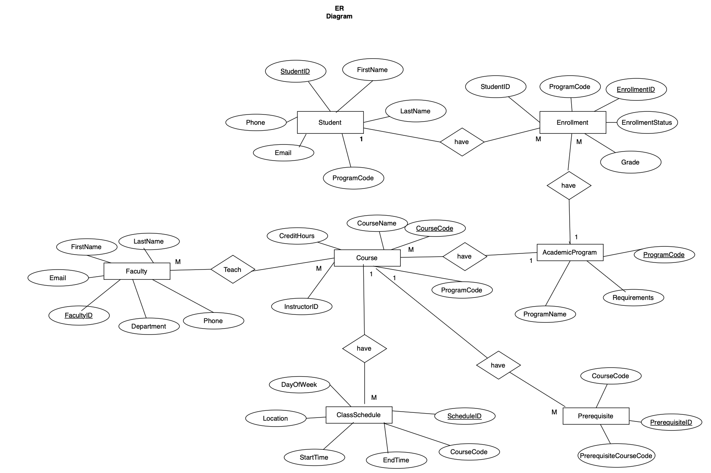

# University Registration Database System

A comprehensive MySQL database for managing university registrations, courses, students, and faculty.

## Features
- Student enrollment tracking
- Course management with prerequisites
- Faculty assignment
- Class scheduling

## Database Schema


## Setup
1. Create database:
   ```sql
   CREATE DATABASE UniversityRegistrationSystem;
   USE UniversityRegistrationSystem;

2. Run schema:
   mysql -u username -p UniversityRegistrationSystem < database/schema.sql

3. Load sample data:
   mysql -u username -p UniversityRegistrationSystem < database/sample_data.sql